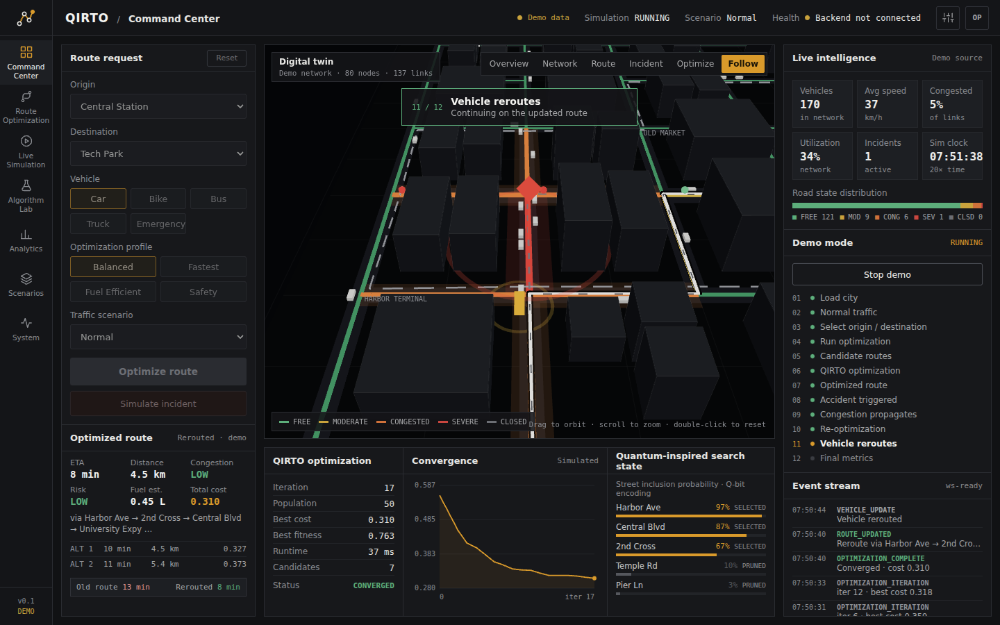

# QIRTO

**Quantum-Inspired Intelligent Traffic Route Optimization**
Intelligent routing for dynamic transportation networks.

QIRTO is a transportation command center: a live 3D digital twin of a road network, a quantum-inspired multi-objective route optimizer, incident-driven re-routing, algorithm benchmarking and scenario management.

This repository is the **frontend product shell**. It runs completely on its own in **demo mode** and is wired to connect to a FastAPI + SUMO + PostGIS backend in **live mode** without UI changes.



> Wording rule used throughout: *quantum-inspired optimization* — a classical algorithm inspired by quantum concepts. QIRTO does not use quantum hardware, and nothing in this UI claims one algorithm beats another. Simulated and demo values are always labelled.

---

## Quick start

```bash
npm install
npm run dev          # http://localhost:5173
```

Then open **Command Center → Run demo sequence**. It plays the full 12-step story with no backend:
normal traffic → origin/destination → candidate routes → QIRTO optimization → optimized route → accident → congestion spreads → re-optimization → vehicle reroutes → final metrics.

```bash
npm run build        # type-check + production build into dist/
npm run preview      # serve the production build
```

Requirements: Node 20+ (tested on Node 22).

## Screens

| Route | Screen | What it does |
|---|---|---|
| `/` | Command Center | Route request, 3D digital twin with 6 camera modes, optimization panel, convergence chart, quantum-inspired search state, live intelligence, demo mode |
| `/route` | Route Optimization | Objective-weight sliders with live recompute, candidate table, objective-space scatter, backend request preview |
| `/simulation` | Live Simulation | Play / pause / reset / 0.5–5× speed, inject accident / congestion / rain / closure, live stats and trends |
| `/lab` | Algorithm Lab | Dijkstra · A* · GA · PSO · QIRTO comparison table, metric bars, convergence (backend data; labelled fixture in demo) |
| `/analytics` | Analytics | Filterable charts: congestion over time, speed, travel time, cost, convergence, route distribution, algorithm comparison |
| `/scenarios` | Scenario Manager | Create/edit/duplicate scenarios: density, weather, closures, accidents, vehicle mix, O/D |
| `/system` | System Health | SUMO / FastAPI / Optimizer / WebSocket / Database status, WebSocket channels, event contract |

More screenshots in [`docs/screenshots`](docs/screenshots).

## Demo mode vs live mode

Copy `.env.example` to `.env`:

```bash
VITE_DATA_SOURCE=demo          # demo | live
VITE_API_URL=http://localhost:8000
VITE_WS_URL=ws://localhost:8000
```

- **demo** — `src/mock/` provides a synthetic 10×8 city, a traffic model with incident spill-back, a route solver and an animated optimizer run. Everything it produces is tagged `source: 'demo'` and shown as *Demo data* / *Simulated* in the UI.
- **live** — every service calls the FastAPI endpoints and subscribes to `/ws/traffic`, `/ws/optimization`, `/ws/simulation`. The contract is in [`docs/BACKEND_CONTRACT.md`](docs/BACKEND_CONTRACT.md).

Components never import from `src/mock/` — they only talk to `src/services/`.

## Project structure

```
src/
  config.ts                 env → DATA_SOURCE, API_URL, WS_URL
  types/domain.ts           the data contract (Road, Route, OptimizationRun, Scenario, …)
  styles/                   design tokens (graphite console) + base primitives
  services/                 api, traffic, route, optimization, simulation, websocket, scenario, experiment, analytics, health
    world.ts                live world store (stats, simulation state, incidents)
    live/                   websocket → world adapter
  mock/                     DEMO ONLY: network, TrafficEngine, optimizer animation, fixtures, event bus
  hooks/                    useWorld, useAsync, useElementWidth
  components/
    shell/                  AppShell, Sidebar, TopBar
    three/                  ThreeCity + CameraController, RoadNetwork, Buildings, VehicleLayer, RouteLayer, IncidentLayer, …
    charts/                 LineChart, BarList (plain SVG, no chart library)
  features/                 one folder per screen
```

## Build it screen by screen

The git history is the build guide — one commit per step, each one builds and runs:

```bash
git log --oneline --reverse
git checkout <step-commit>   # see the app at that step
```

[`docs/BUILD_GUIDE.md`](docs/BUILD_GUIDE.md) walks through every step with what to build, which files, how to check it and a ready-to-use prompt if you want to rebuild or extend a screen with an AI coding tool (Lovable, Claude, Cursor…).

## Docs

- [`docs/BUILD_GUIDE.md`](docs/BUILD_GUIDE.md) — step-by-step build order
- [`docs/ARCHITECTURE.md`](docs/ARCHITECTURE.md) — layers, data flow, 3D scene, demo director
- [`docs/BACKEND_CONTRACT.md`](docs/BACKEND_CONTRACT.md) — REST endpoints, WebSocket events, payloads
- [`docs/DESIGN_SYSTEM.md`](docs/DESIGN_SYSTEM.md) — colours, type, components, rules

## Tech

React 19 · TypeScript · Vite · React Router · Three.js · React Three Fiber · Drei. No UI framework, no chart library — styling is plain CSS on design tokens.
